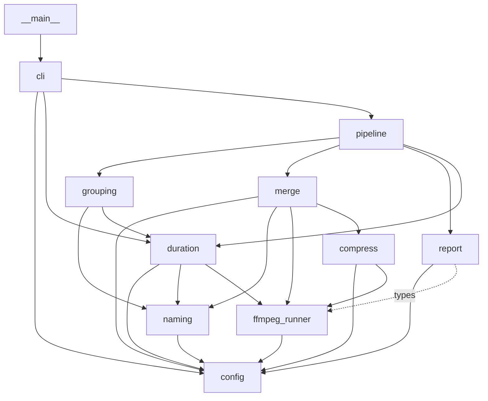
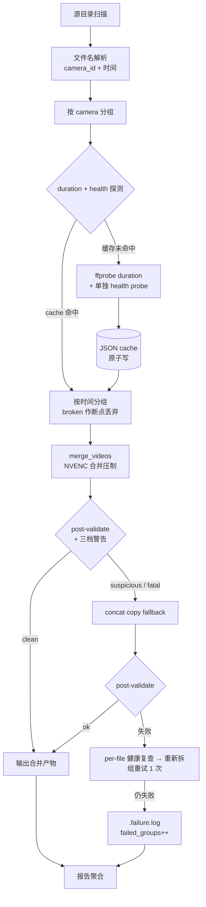

# car_replay

行车记录仪录像 **拼接 + 压制** 工具的子包版本。源切片（1/2/3/5 分钟不等，多通道、多命名格式）扫一遍 → 按摄像头与时间分组 → NVENC 压制（失败降级 concat copy）→ 输出可长期归档的合并片。

## 概述

原 `combine_car_replay.py` 单文件 1300+ 行，混了 PowerShell 元数据读取、自适应抽样分治填时长、两个旁支脚本，难维护。本次拆成 12 个职责单一的模块，并落地 3 项稳定性补丁：

- **磁盘缓存**：几万文件首次跑慢、二次跑秒过
- **broken 断点**：整文件损坏的源作为时间分组断点并自身丢弃
- **post-validate + 三档警告**：压制完成后再校验，可疑/失败 → concat copy 兜底，杜绝产物画面卡死
- **负压缩防护（pre-flight + 运行时迟滞监控 + post-check + 文件夹熔断）**：避免 NVENC 在低码率素材上反向膨胀浪费 GPU

适用场景：`\\10.8.28.10\iot\360CAR`、`LS_AR_IMX335`、`LS_S3` 三目录持续合并压制后长期仅保留压制产物。

## 快速开始

| 平台 | 命令 |
|---|---|
| Windows（推荐） | `python -m car_replay --src "\\10.8.28.10\iot\LS_S3"` |
| Windows（兼容旧入口） | `python car_replay\combine_car_replay.py --src "\\10.8.28.10\iot\LS_S3"` |
| Linux/WSL | `python3 -m car_replay --src /mnt/iot/LS_S3` |

依赖：

- Python ≥ 3.8
- `ffmpeg` / `ffprobe`：先查仓库 `.vendor/ffmpeg/`，否则走系统 `PATH`
- NVENC：可选；未启用 `--compress` 或不可用时自动走 concat copy

## CLI 参数总览

跑 `python3 -m car_replay --help` 输出实时为准，下表是核心字段速查：

| 参数 | 说明 |
|---|---|
| `--src PATH` | 源目录（必填） |
| `--compress` / `--no-compress` | 是否进行 NVENC 压缩 |
| `--cq N` | 覆盖默认按通道差异化 CQ |
| `--max-gap-seconds N` | 时间分组的最大间隔（秒） |
| `--clip-duration-seconds N` | ffprobe 失败/禁用时的显式兜底切片时长 |
| `--no-ffprobe-duration` | 禁用时长探测，仅用文件名 + 兜底值 |
| `--no-hybrid` | 禁用混合模式（坏输入也强压 NVENC） |
| `--allow-combined-input` | 允许从含 `_Combined` 的目录读取 |
| `--cache-dir PATH` | **新**：覆盖默认缓存目录 `<repo>/.data/car_replay` |
| `--no-cache` | **新**：禁用磁盘缓存（调试用） |
| `--probe-workers N` | **新**：ffprobe 并发线程数（默认 4） |
| `--probe-timeout N` | **新**：单文件 ffprobe 超时秒数（默认 60） |
| `--no-broken-split` | **新**：跳过 broken 健康探测，快速但漏检 |
| `--monthly-subdirs auto\|on\|off` | **新**：输出按 `<dst>/YYYYMM/...` 分子目录；auto 仅对 `XIAOMI_*` 设备启用 |
| `--max-group-duration-seconds N` | **新**：单个合并段累计时长上限 (默认 7200=2h, 0 关闭) |
| `--no-windows-metadata-duration` | **deprecated no-op**：仅打 warning |
| `--exact-duration-probing` | **deprecated no-op**：仅打 warning |

## 架构

12 个模块，依赖方向严格自下而上。`report` 不参与业务流程，只接收已构造好的 tracker / result。



各模块职责：

| 模块 | 职责 |
|---|---|
| `config` | 路径常量、`COMPRESS_PROFILES`、`WARNING_PATTERNS`、`resolve_executable` |
| `naming` | 5 种文件名解析 + camera_id 抽取 |
| `ffmpeg_runner` | `_run_ffmpeg_capturing_warnings` + 三档 `WarningTracker` |
| `duration` | `DurationResolver` + `DurationCache`（JSON 持久化） |
| `grouping` | 按 camera 分组 + 按时间分组（含 broken 断点） |
| `compress` | 单文件压制 + post-validate |
| `merge` | 多文件 NVENC 合并、`-c copy` 直拼、`_concat_copy_fallback` |
| `report` | 警告汇总报告 |
| `pipeline` | `process_videos_in_folder` 主循环 |
| `cli` | argparse + 装配 |
| `__main__` | `python -m car_replay` 入口 |
| `combine_car_replay.py` | 兼容 shim，转发到 `cli.main()` |

## 数据流



## 错误处理 / 降级链

四层防线，任一通过即停：

| 层 | 触发 | 处理 |
|---|---|---|
| 1. 整文件损坏 | grouping 阶段 `is_broken(path) == True` | 作时间分组**断点**，broken 文件**自身丢弃** |
| 2. NVENC 压制可疑/失败 | `is_fatal()` 或 `is_suspicious()` 或 `post_validate()` 任一不过 | 删 temp 产物 → `_concat_copy_fallback`（concat -c copy） |
| 3. concat copy 失败 | post_validate 失败 | `ensure_health_probed` 全员 → 找新 broken → 切子组 → 单次重试 |
| 4. 主循环兜底 | 任意未捕获异常 | 该组 `failed_groups++` + 写 `<output>.failure.log` + 继续下一组 |

**WarningTracker 三档判定**：

- `is_clean`：无致命也无可疑
- `is_suspicious`：命中 `SUSPICIOUS_RULES` 任一 / `unmatched_error_lines > 50`（绝对）/ `error_lines/min > 30`（按 elapsed 归一化）
- `is_fatal`：returncode != 0 或致命模式命中

`post_validate`：ffprobe 能开 + duration 在期望 ±5% + size > 0。

## 负压缩防护

NVENC 在低码率原片（夜间静止画面、本就低码率车规摄像头）上会被 `-rc vbr -cq N -maxrate ...` 推到接近 maxrate，**输出反而比输入大**。四层防护：

| 层 | 位置 | 触发 | 处理 |
|---|---|---|---|
| 1. Pre-flight 码率预检 | `merge.py` 入口 | 输入平均码率 < `profile.bitrate × PREFLIGHT_BITRATE_MARGIN` (1.1) | 不进 NVENC，直接 concat copy；计入熔断计数 |
| 2. 运行时迟滞监控 | `ffmpeg_runner._run_ffmpeg_capturing_warnings` | warmup 30s 后，`predicted_final_ratio` 跨进 0.95 → WARN；持续 20s 仍 > 1.0 → 中断 | `proc.terminate()` → 哨兵 `rc = NEGATIVE_COMPRESSION_ABORT_RC (-2)`，调用方删 temp 走 concat copy |
| 3. Post-run 兜底 | `compress.py` / `merge.py` 成功路径 | 跑完一切正常，但 `out_size > in_size` | 删产物，concat copy fallback |
| 4. 文件夹级熔断 | `pipeline.py` | 同一文件夹累计 `NEGATIVE_COMPRESSION_FOLDER_BREAKER` (5) 次反向膨胀 | 本文件夹剩余组 `enable_compress=False` |

阈值集中在 `config.py::NEGATIVE_COMPRESSION_THRESHOLDS` 与同名常量，需要调整在那里改。

## 缓存机制

- 路径：默认 `<repo>/.data/car_replay/cache.json`，可被 `--cache-dir` 覆盖
- key：`os.path.normcase(os.path.abspath(path))`
- fingerprint：`(size, mtime_ns, ctime_ns)`，任一变 → 失效重 probe
- entry：`{duration, source, health: {healthy, broken, probed_at}}`
- `broken=true` 永久缓存（坏文件大概率不自愈）
- 写入：写 tmp → `os.replace` 原子替换；JSON 损坏静默重建
- `--no-cache` 关闭整个缓存（仅调试）

几万文件首次仍要全量 ffprobe，但二次起命中率接近 100%，秒级过完探测阶段。

## 安全模式 vs 快速模式

| 模式 | 命令片段 | 首次速度 | 漏检风险 |
|---|---|---|---|
| **默认安全** | （无） | 慢（每文件 ffprobe duration + health） | 低 |
| 跳过 health | `--no-broken-split` | 中（仅 duration） | 整文件损坏可能漏识别 |
| 极速 | `--no-ffprobe-duration --clip-duration-seconds 60` | 快（仅文件名 + 兜底） | 分组精度下降，时间边界可能错位 |

二次跑命中缓存后三种模式差距可忽略；首次跑且数据量大时按容忍度选。

## 平台差异

| 维度 | Windows | Linux / WSL |
|---|---|---|
| SMB 访问 | `\\10.8.28.10\iot\LS_S3` UNC 直接传 | `/mnt/iot/LS_S3` 经 cifs/automount |
| ffmpeg/ffprobe | `.vendor/ffmpeg/<name>.exe` 优先，否则 PATH | `.vendor/ffmpeg/<name>` 优先，否则 PATH |
| 路径归一化 | `os.path.normcase`（盘符大小写 + UNC） | `os.path.normcase`（POSIX 不变） |
| NVENC | 通常可用 | 视驱动而定，不可用自动走 fallback |

跨平台 cache key 不互通（normcase 后的形态不同），各平台维护各自的 `<repo>/.data/car_replay/`。

## 已删的历史包袱

读者无需在代码里再纠结这些：

- **PowerShell `Shell.Application` 批量 metadata**：删除，统一走 ffprobe
- **`_adaptive_fill` 自适应抽样分治**：删除，靠磁盘缓存解决性能
- **`combine_car_replay_compress_existing.py`**：旁支脚本，删除
- **`combine_car_replay_compress_test.py`**：旁支脚本，删除
- **`__tests__/`**：自动化测试，删除（用户决定靠真实数据手测）
- **WarningTracker 14 类细分输出**：内部计数保留；对外简化为三档

## 手测命令清单（smoke）

下列命令**留给用户运行**，覆盖六个验收点。三个真实路径不替换。

### 1. 首次跑（最小子目录，安全模式）

Windows / PowerShell：

```powershell
python -m car_replay --src "\\10.8.28.10\iot\LS_S3\<选一天>" --compress
```

Linux / WSL bash：

```bash
python3 -m car_replay --src "/mnt/iot/LS_S3/<选一天>" --compress
```

### 2. 二次跑同目录验证 cache 命中

重复执行第 1 条命令，观察日志中应出现大量 `cache hit` 字样、ffprobe 实际调用大幅下降、整体耗时显著缩短。

### 3. 快速模式对比

Windows：

```powershell
python -m car_replay --src "\\10.8.28.10\iot\LS_S3\<选一天>" --compress --no-broken-split
```

Linux / WSL：

```bash
python3 -m car_replay --src "/mnt/iot/LS_S3/<选一天>" --compress --no-broken-split
```

对比第 1 条首次耗时（清空 `<repo>/.data/car_replay/` 后再跑以保证公平）。

### 4. 制造损坏文件验证 broken 断点

Linux / WSL：

```bash
cp /mnt/iot/LS_S3/<选一天>/<某.ts> ./broken_sample.ts
truncate -s 1024 ./broken_sample.ts
cp ./broken_sample.ts /mnt/iot/LS_S3/<选一天>/_broken_smoke.ts
python3 -m car_replay --src "/mnt/iot/LS_S3/<选一天>" --compress
```

Windows：

```powershell
$src = "\\10.8.28.10\iot\LS_S3\<选一天>"
Copy-Item "$src\<某.ts>" .\broken_sample.ts
$f = [IO.File]::OpenWrite('.\broken_sample.ts'); $f.SetLength(1024); $f.Close()
Copy-Item .\broken_sample.ts "$src\_broken_smoke.ts"
python -m car_replay --src $src --compress
```

期望：日志标识 `_broken_smoke.ts` 为 broken，作为分组断点丢弃，组内其它文件正常合并。**测完务必删掉 `_broken_smoke.ts`。**

### 5. 强制压制失败回退

把全局 CQ 打成非法值，看是否走 concat copy fallback：

Windows：

```powershell
python -m car_replay --src "\\10.8.28.10\iot\LS_S3\<选一天>" --compress --cq 999
```

Linux / WSL：

```bash
python3 -m car_replay --src "/mnt/iot/LS_S3/<选一天>" --compress --cq 999
```

期望：NVENC 失败 → 删 temp → concat copy 兜底 → 产物可播放。

### 6. 三个真实目录的命令模板

**Windows / PowerShell**：

```powershell
python -m car_replay --src "\\10.8.28.10\iot\360CAR" --compress
python -m car_replay --src "\\10.8.28.10\iot\LS_AR_IMX335" --compress
python -m car_replay --src "\\10.8.28.10\iot\LS_S3" --compress
```

**Linux / WSL bash**：

```bash
python3 -m car_replay --src "/mnt/iot/360CAR" --compress
python3 -m car_replay --src "/mnt/iot/LS_AR_IMX335" --compress
python3 -m car_replay --src "/mnt/iot/LS_S3" --compress
```

首次跑前建议先在某一天的子目录用第 1~5 条把降级链验过一轮再放大到全目录。

## 小米摄像头支持

除了行车记录仪，本工具也支持小米家用摄像头的两种常见目录布局，输入端通过 `naming.py` 自动识别，输出端默认按月分子目录以避免十万级文件平铺。

### 模式 A：`XiaomiCamera_NN_<MAC>/` 顶层平铺

文件名：`<NN>_<开始YYYYMMDDhhmmss>_<结束YYYYMMDDhhmmss>.mp4`，例 `00_20250516070050_20250516072431.mp4`。

- 起止时间均从文件名解析，**无需 ffprobe**，分组最快
- `camera_key = XIAOMI_A:<目录名>`；多通道（NN）独立分组
- 输出文件名：`<start>_<end>_Xiaomi_<NN>_<MAC尾4位>.mp4`

### 模式 B：`xiaomi_camera_videos/<MAC>/<YYYYMMDDHH>/`（小时分桶）

文件名：`<MM>M<SS>S_<unix_ts>.mp4`，例 `00M56S_1747350056.mp4`。

- start = `unix_ts`；end 需 ffprobe 兜底（命中 cache 后秒过）
- 单设备可能有 8 千+ 小时目录、数万文件 → 首次跑磁盘缓存填充耗时大，强烈建议先用单小时子目录 smoke
- `camera_key = XIAOMI_B:<MAC>`；输出文件名：`<start>_<end>_Xiaomi_<MAC尾4位>.mp4`

### 推荐 CLI（小米场景）

```bash
# 小米模式 A：单设备目录
python3 -m car_replay --src "/mnt/iot/XiaomiCamera_00_B888801AFBCE" --compress

# 小米模式 B：单小时目录先 smoke
python3 -m car_replay \
  --src "/mnt/iot/xiaomi_camera_videos/607ea4179a51/2025051607" --compress

# 全量跑（B 模式量极大，建议加快速模式）
python3 -m car_replay \
  --src "/mnt/iot/xiaomi_camera_videos/607ea4179a51" --compress \
  --no-broken-split
```

输出布局示例：`<src>_Combined/202505/20250516070050_20250516072431_Xiaomi_00_FBCE.mp4`

### 编码方向

监控源通常是 H.264 / AAC；本工具复用现有 `hevc_nvenc` 管线 → 输出 **H.265**，长期归档省空间。监控画面相对静态，默认 CQ 已能压得很小，未单独新增 profile。如压完过糊可用 `--cq N` 临时覆盖。
